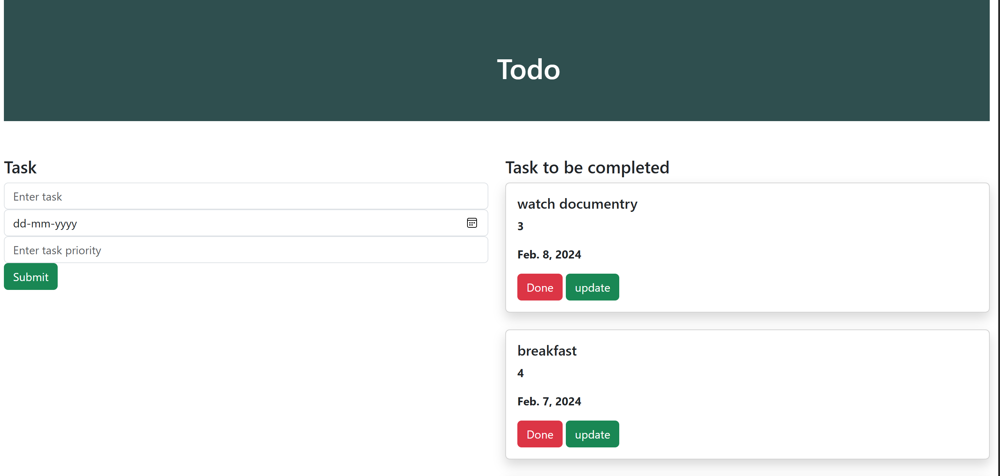

# ✅ Django Todo App

A simple and functional Todo List application built with **Django**. This app allows users to create, update, and delete tasks efficiently. Ideal for learning Django basics and building CRUD functionality.

---

## 🚀 Features

- 📝 Add new tasks
- ✏️ Edit existing tasks
- ✅ Mark tasks as complete
- ❌ Delete tasks
- 📆 View all tasks in a list
- 🔒 User authentication (optional if added)

---

## 🛠️ Tech Stack

- Python 3.x  
- Django 4.x  
- HTML & CSS (Django Templates)  
- SQLite3 (default DB)


## 📸 Screenshots

### 📋 Task List View and Add/Edit Task View
<p align="center">
  
</p>

📂 Folder Structure
```
Todo_App/
├── mysite/
│   ├── todo/            # Main app
│   │   ├── migrations/
│   │   ├── templates/
│   │   │   └── todo/
│   │   │       ├── base.html
│   │   │       ├── index.html
│   │   │       └── ...
│   │   ├── admin.py
│   │   ├── models.py
│   │   ├── views.py
│   │   └── urls.py
│   ├── mysite/
│   │   ├── settings.py
│   │   ├── urls.py
│   │   └── wsgi.py
│   ├── db.sqlite3
│   └── manage.py
```

## ⚙️ How to Run Locally

1. **Clone the repository**
   ```bash
   git clone https://github.com/rashi311/Todo_App.git
   cd Todo_App/mysite
   
2.Create a virtual environment
   ```bash
   python -m venv venv
   source venv/bin/activate  # On Windows: venv\Scripts\activate
   ```

3.Install dependencies
```bash
pip install django
```

4.Apply migrations
```bash
python manage.py makemigrations
python manage.py migrate
```

5.Run the development server
```bash
python manage.py runserver
```
  6.Open in your browser
```bash
http://127.0.0.1:8000/
```


✍️ Customize Tasks
   Tasks can be managed from the main page or the Django admin interface. To access admin:
   
  1.Create a superuser:
  ```
   python manage.py createsuperuser
  ```
  
  2.Go to admin
  ```
   http://127.0.0.1:8000/admin/
  
 

